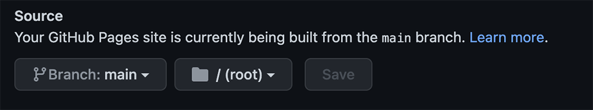

# DEMON BLACKJACK

This is a game of Black Jack against The Demon Computer!!!! Can you beat the Demon?

The goal of this game is to get as many points as possible but without going over 21 points, because then you will automatically lose the hand!

---

# Game Features

+ **Game Play**

  + Game area where the cards are displayed

  + Four Game buttons to Reset Game, New Hand, Hit & Stay
  
  + Two information buttons, One for the game instructions and the other for the Card Values in the game

___

## Future Features

+ Add individual beer pages with more information
___

## Typography & Colour Scheme
+ Headlines are the Press Start 2P font
+ Body and Subheadings are the Work Sans font
+ The colour scheme is base background black #000 , h1 font #fff and outlined with rgb(238, 2, 2)
___

## Wireframe

+ Game Page

___

# Technology

+ HTML
+ CSS
+ Javascript
+ Gitpod
+ Github
___

# Testing

+ Lighthouse
  + The site has been tested with Lighthouse and is 100% Accessible, 100% Best Practices, 100% SEO & 97% Performance scores
   

+ Responsive design
  + The site has been tested on Iphone12, Ipad and desktop and is responsive
___
# Validator Testing

+ HTML
  + No errors were returned when passing through the official W3C validator 
+ CSS
  + No errors were found when passing through the official (Jigsaw) validator
+ JavaScript
  + Tested on JSHINT validator and no errors or warnings where found

___
# Bugs

+ CSS
  + Found some issues with the reponsive CSS due to the game area having to be a certain size to be able to play the game.
  + Fixed the issues as best I could 

  ___
# Deployment

+ The site was deployed to GitHub pages. The steps to deploy are as follows:
  + In the GitHub repository, navigate to the Settings tab, click the Pages button on the left menu
  + From the source section drop-down menu, select the Master Branch
  + Once the master branch has been selected and saved, the page will be automatically refreshed with a detailed ribbon display to indicate the successful deployment.

The live link can be found here - <https://artcuddy.github.io/project2-blackjack/>

  ___
# Credits

+ Content
  + All icons are from [Font Awesome](https://fontawesome.com/ "Font Awesome")
  + All fonts are from [Google Fonts](https://fonts.google.com/ "Google Fonts")

+ Media
  + Background digital artwork created by my son Alfie Cuddy (12 Years Old)
  + Popup notifications created with [Sweet Alert 2](https://sweetalert2.github.io/ "Sweet Alert 2")
  + Inspiration for the game build from this tutorial by Ethan Jarrel on [Hackernoon](https://hackernoon.com/blackjack-application-with-javascript-2c76db51dea7 "Hackernoon") 