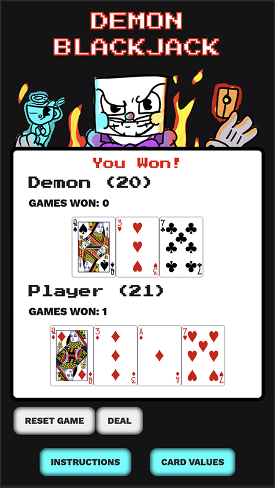
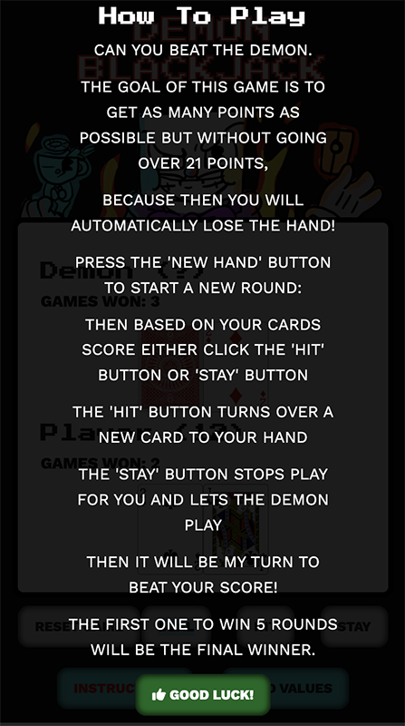

# DEMON BLACKJACK

This is a game of Black Jack against The Demon Computer!!!! Can you beat the Demon?

The goal of this game is to get as many points as possible but without going over 21 points, because then you will automatically lose the hand!

---

# User stories
Users of this website will be able to play the game of Blackjack against the computer.  

# Website owner
Offer the puclic a free game, easy to use to enjoy a game of BlackJack.  

# Game Features

+ **Game Play**

  + Game area where the cards are displayed

  + Four Game buttons to Reset Game, New Hand, Hit & Stay
  
  + Two information buttons, One for the game instructions and the other for the Card Values in the game

  + Clicking on the instruction button shows information on how to play the game

  + Clicking on the card value button shows information on the value of the cards in the game

  + Sounds are played when pressing the hit, stay & reset game buttons

  + The game is over when you win or lose 5 games

  + When you win or lose an overlay screen will be shown indicating that the game is over and sound is played.

___

## Future Features

+ Add player name submission 
___

## Typography & Colour Scheme
+ Headlines are the Press Start 2P font
+ Body and Subheadings are the Work Sans font
+ The colour scheme is base background black #000 , h1 font #fff and outlined with rgb(238, 2, 2)
___

## Wireframe

+ Game Page

___

# Technology

+ HTML - for building the UI
+ CSS - for styling the UI
+ Javascript - for the the game play and interaction
+ Gitpod - for the game development
+ Github Pages - to host the game
+ Deck of Cards API - to create the cards and shuffle the decks
___

# Testing

+ Lighthouse
  + The site has been tested with Lighthouse and is 100% Accessible, 100% Best Practices, 100% SEO & 97% Performance scores
   

+ Responsive design
  + The website was tested using Chrome developer tools and Mozilla Developer tools. The website was tested with Chrome, Mozilla, Safari and Edge browsers on both a Mac computer and a Windows computer, it was also tested for mobile on an iPhone 6, iPhone 11, iPhone 13 Pro, Pixel 4, Pixel 5 and Galaxy S10.  

___

# Testing Sequence

+ Game Play
  + Click the Deal button to start a game
  + 2 cards should be dealt to the player and the demon
  + The Demons first card should be turned over so it cannot be seen
  + Click the hit button to get a new players card
  + Click the stay button to stop playing
  + The demon should now play until he draws more than 17 or equal
  + If the demon gets more than 21 he busts and the player should win the round

  

  + If the player gets more than 21 he busts and the demon should win the round

  
  
  + If the player has a higher score but not over 21 the player should win the round

  

  + If the score is equal then it's a tie and the voiceover should play "it's a tie"

  

  + If the demon has a higher score then the player loses the round

  

  + Click the reset game button to start a new game

  + The reset game warning should popup when the reset game button is clicked, this can be confirmed or cancelled

  

  + The game is over if the player wins or loses 5 rounds

  

  + The Game Over overlay can be clicked to reset the game

  

+ Instructions
  + The instructions button should open the popup modal with the game instructions when clicked
  
  

  + The card value button should open the card value instructions when clicked

  

# Validator Testing

+ HTML
  + No errors were returned when passing through the official W3C validator 
+ CSS
  + No errors were found when passing through the official (Jigsaw) validator
+ JavaScript
  + Tested on JSHINT validator and no errors or warnings where found

___
# Bugs

+ CSS
  + Found some issues with the reponsive CSS due to the game area having to be a certain size to be able to play the game.
  + Fixed the issues as best I could 

# Unfixed Bugs
None found at the moment.  
  ___
# Deployment

+ The game site was deployed to GitHub pages. The steps to deploy are as follows:
  + In the GitHub repository, navigate to the Settings tab, click the Pages button on the left menu
  + From the source section drop-down menu, select the Master Branch
  + Once the master branch has been selected and saved, the page will be automatically refreshed with a detailed ribbon display to indicate the successful deployment.

+ The game site was developed on Gitpod. 

The live link can be found here - <https://artcuddy.github.io/project2-blackjack/>

  ___
# Credits

+ My Code Institute mentor Rohit Sharma for keeping me on track with the code

+ Content
  + All icons are from [Font Awesome](https://fontawesome.com/ "Font Awesome")
  + All fonts are from [Google Fonts](https://fonts.google.com/ "Google Fonts")

+ Media and Libraries
  + Background digital artwork of King Dice created by my son Alfie Cuddy (12 Years Old)
  + Inspiration for the game build from this tutorial by Ethan Jarrel on [Hackernoon](https://hackernoon.com/blackjack-application-with-javascript-2c76db51dea7 "Hackernoon") 
  + Cards created with [Deck of Cards API](https://deckofcardsapi.com/ "Deck of Cards API")